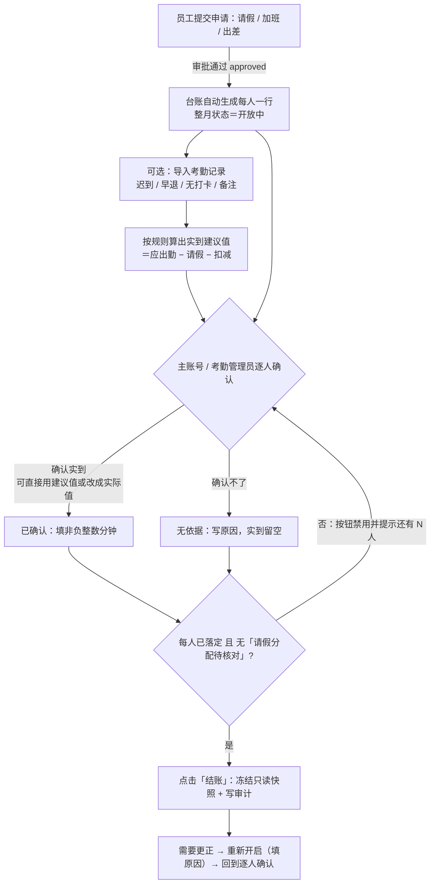

# 考勤台账与月结流程

日期：2026-09-30。本文讲清「月度考勤台账」的两层状态、每一步由谁操作、结账的前置条件，
以及「无依据」状态该怎么用。面向使用系统的人（财务、考勤管理员、员工），不是接口文档。

相关代码：
- 后端 `controllers/api/attendance-ledger.js`（读取 / 保存一行 / 结账 / 重新开启 / 统计 / 实到计算规则）
- 实到计算规则 `utils/attendance-ledger-actual.js`（默认值唯一来源 + 建议值计算 + 校验）
- 模型 `models/AttendanceMonthLedger.js`（整月状态 + 每人一行 + 结账快照 + 审计）
- 页面 `front_end/src/pages/attendance/ledger/index.vue`（明细台账）、`components/LedgerStatistics.vue`（统计汇总）、
  `components/LedgerImportDialog.vue`（导入考勤记录）

## 1. 流程图

要点：**只有审批通过（approved）的申请才进台账**；台账不是打卡，实到靠人工确认。

## 2. 两层状态，别混

| 层级 | 字段 | 取值 | 含义 |
| --- | --- | --- | --- |
| 整月台账 | `AttendanceMonthLedger.status` | `open` 开放中 | 可逐人确认、可修改；**应出勤每次都按当前工作日历重算**，改了日历立刻生效 |
| | | `closed` 已结账 | 只读，读的是结账那一刻的 `closedSnapshot`；要改必须「重新开启」并填原因 |
| 每人一行 | `rows[].confirmationState` | `pending` 待确认 | 新建台账行的默认值，还没人确认 |
| | | `confirmed` 已确认 | 已确认实到，必须有非负整数分钟 |
| | | `no_basis` 无依据 | 确认不了实到，必须写原因且实到留空（见第 4 节） |

「开放中 / 已结账」管的是**整月能不能再改**；「待确认 / 已确认 / 无依据」管的是**这个人这一行有没有落定**。
后者的全部落定，是结账的闸门。

## 3. 谁做什么

| 角色 | 可见范围 | 能做什么 |
| --- | --- | --- |
| 公司主账号 | 全公司 | 逐人确认、结账、重新开启、维护实到计算规则 |
| 考勤管理员（`attendance_admin`） | 全公司 | 同上 |
| 总经理（`general_manager`） | 全公司 | 只看 |
| 经理（`manager`） | 自己的直属团队 | 只看 |
| 其他（员工、财务等） | 本人 | 只看自己那一行 |

- 后端守卫是 `isMonthAdmin`（主账号 或 `attendance_admin`），与前端 `canManage` 同一口径。
- 「考勤管理员」在 **考勤与工资 → 设置 → 员工资料** 里勾选（能进该页的是主账号或管理员）；
  总经理由「用户管理 → 职位」（gm / ceo）同步而来。
- 非管理员在页面上看到的提示：**每人的实到确认与本月结账由公司主账号或考勤管理员执行**，
  显示「待确认」是等他们确认，不需要本人操作。

## 4. 「无依据」怎么用

### 是什么

「无依据」= **这一行确认不了实到时长，但要把它落定**，好让整月能结账。
它不是「这个人没出勤」，而是「我们手上有依据地算不出实到分钟」。

### 什么时候填

- 该员工当月**没有任何可依据的出勤记录**（系统没有打卡数据，也没有足够记录能推算实到）
- 新入职 / 离职当月不满月，本系统不掌握其考勤的月份
- 长期外派、借调，考勤不在本系统里
- 系统刚上线，历史月份没有数据

### 与「实到 0 分钟」的区别（最容易填错）

| 填法 | 表示 |
| --- | --- |
| 已确认 + 实到 `0` | **有依据地认定为 0**：这个人当月确实一分钟都没到 |
| 无依据 + 原因 | **不知道**：实到时长无从确认，实到必须留空 |

拿不准就填「无依据 + 原因」，**不要用 0 冒充**——这两个数字在口径上完全不同。

### 怎么填

1. 点该行行末的「编辑」
2. 「确认状态」选 **无依据**（选完实到输入框会自动禁用并清空）
3. 在「说明」里写原因 —— **必填**，不写点保存会提示「无考勤依据时请填写原因」
4. 点对勾保存

后端校验：`no_basis` 时 `actualMinutes` 必须是 `null`，`note` 必须非空（两者任一不合就 400）。

### 填了之后的影响

- 这一行不再是「待确认」，**不挡结账**
- 这一个人**不计入「已确认实到」合计**（汇总只累加已确认行的实到分钟）
- 整月结账后照常进快照，页面能看到当时写的原因

## 5. 导入考勤记录（迟到 / 早退 / 无打卡 / 备注）

**解决什么问题**：确认「实到分钟」时手上没有依据。把外部考勤表里的迟到 / 早退次数、无打卡记录次数、
备注导入到每位员工这一行，作为确认实到时的参考。

- **入口**：台账工具栏「导入考勤」。仅**公司主账号 / 考勤管理员**可用；已结账的月份不能导入（返回 409）。
- **模板**：弹窗里的「下载模板」；也可以直接用现有的考勤表——按**表头文字**识别列，不要求列顺序，
  两级表头（「迟到」跨三列 + 下一行「10分钟以内 / 以上 / 合计」）也能识别。
- **流程**：选文件 → 逐行核对（自动按姓名匹配；同名或名单里没有时，在「对应员工」里手动指定）
  → 导入 → 逐条显示结果（已更新 / 已新建行 / 失败原因）。
- **导入的内容**：迟到（≤10 分钟 / >10 分钟 / 合计）**次数**、早退次数、无打卡记录次数、备注。
- **不导入请假**：请假以系统里审批通过的申请单为准，避免两套口径打架（考勤表里的「请假」列会被忽略）。
- **空单元格 = 不动原有值**；填 `0` 是有效值（表示确认没有这类情况）。重复导入不会清空已确认的内容。
- 表尾的说明行（如「注：空白表示没有违纪行为」）与模板自带的示例行会被自动跳过。

**关键口径**：导入的只是**次数**，本身不等于实到。它作为第 6 节「实到自动计算」的扣减依据；
导入**不会**改动实到分钟与确认状态——实到按规则算成建议值后，仍由考勤管理员确认或修改。

模板列（列名能识别即可，顺序不限）：

| 姓名 | 迟到 10分钟以内 | 迟到 10分钟以上 | 迟到合计 | 早退 | 无打卡记录 | 备注 |
| --- | --- | --- | --- | --- | --- | --- |
| 王XX | 1 | 3 | 4 | | 2 | 8号、19号请假半天 |

导入后，这一列会显示在台账的「考勤记录（导入）」列里，与实到分钟分开。

## 6. 实到分钟怎么自动算（可改）

**口径**：`实到 = 应出勤 − 请假合计 − 迟到 / 早退 / 无打卡扣减`，下限 0。

- **应出勤**：当月工作日历 × 工作时段算出来的整月时长（与人员无关，见第 8 节）。
- **请假合计**：该员工当月**已通过且已按天分摊**的请假时长，按类型汇总。
- **违纪扣减**：用导入（或手工填）的次数乘以下数值，数值在
  **考勤与工资 → 设置 → 工作日历设置 → 实到分钟计算规则** 里配置：

  | 项目 | 默认值 | 单位 |
  | --- | --- | --- |
  | 迟到（10分钟以内） | 0.5 | 小时/次 |
  | 迟到（10分钟以上） | 1 | 小时/次 |
  | 早退 | 1 | 小时/次 |
  | 无打卡记录 | 1 | 工作日/次（1 个工作日 = 当前工作时段的一天时长，默认 8 小时） |

- **谁能改规则**：仅**公司主账号 / 考勤管理员**（与结账同口径，`isMonthAdmin`）；能看到台账的人都能读到规则。
- 规则只影响**建议值**，改规则不会动已确认/已结账的数据。

### 建议值怎么落到台账

| 情况 | 表现 |
| --- | --- |
| 这一行还没人填过实到 | 台账「实到分钟」列直接显示建议值，并标注「系统建议」（悬浮可看完整计算过程） |
| 点「编辑」 | 实到分钟输入框**预填**建议值，管理员可以直接确认，也可以改成实际值 |
| 管理员改成了别的值 | 这一行记为**人工**：以后再导入、改日历、改规则都**不会**覆盖它 |
| 直接采用建议值保存 | 记为**自动**：以后导入 / 日历变化会跟着重算 |
| 请假未按天分摊（有「请假分配待核对」） | **不给建议值**，仍由人工确认（避免算出一个偏低的数） |
| 本月没有应出勤 | 同上，不给建议值 |
| 扣减超过了应出勤 | 按 0 计，并在说明里写「按 0 计」 |
| 只导入了迟到合计、没分档 | 无法判断该按哪一档扣，**不扣**并在说明里注明 |

**注意**：建议值**只算不写库**。台账读接口每次按当前数据实时算，只有管理员保存那一行时才落库，
所以看台账不会因为别人导入了数据、或日历改了而悄悄改动已确认的数字。

## 7. 结账的四个前置条件

点「结账」时后端会逐条检查，缺一条就拦下（返回 409）：

1. 范围内**每人**要么是「已确认」、要么是「无依据」，不能有「待确认」
2. 「已确认」的行必须有**非负整数**的实到分钟
3. 「无依据」的行必须**写了原因**，且实到为空
4. 不能有「请假分配待核对」的行（请假单没有按天分摊，界面会有橙色提示）

结账会保存只读快照、记录结账人与时间、写 `AttendanceLedgerAudit`；
之后要改必须「重新开启」并填原因，同样留审计。

## 8. 与工资的关系（常见误会）

- **台账的实到不参与算钱**。工资条里的「请假与旷工扣款」由财务手工填写，台账只是给人看的依据。
- 工资表展开明细里的「当月考勤时长」来自**已通过的申请单**（`getMonthlyAttendanceSummary`），
  不要求台账已建立或已结账；台账里登记过的应出勤 / 实到会一并带出，没登记就是 null。
- 所以「台账还没确认」**不会**拦住工资表的录入、发布。

## 9. 其他边界

- 应出勤 = 当月工作日历 × 工作时段，**与人员无关**，整月只算一次；开放中的月份改日历立刻反映。
- 加班 / 出差 / 请假时长全部来自**已批准**的申请单，不是打卡数据。
- **还没批完的申请**（状态 `pending`）会在同一格里另起一行标「待审批 X 小时」，**只作提示**：
  不计入「已批」口径、不参与实到计算；没有未批申请的行不会多这一行。
  待审批的请假如果没按天分摊（算不出时长），只提示「待审批请假（未按天分摊）」。
- **加班的补偿方式有三种：调休 / 加班费 / 无补偿**（加班申请时必选，**默认无补偿**）。台账「已批加班」格会把真有时长的
  方式写出来（如 `调休 1 小时 · 无补偿 1 小时`），**只列有时长的项、不写零**；没有已批加班的行只写「已批 0 小时」。
  加班**总时长与补偿方式无关**（三种方式都计入「已批加班」）；「统计汇总」页只给「已批加班」合计，不拆方式。
- **台账不登记「实际加班 / 实际出差」时长**，界面上也没有这两项——加班与出差只统计已批准的申请时长。
- 「实到分钟」既是**算出来的建议值**，也是**唯一可以人工确认/修改的「实际」数据**；
  钱不算它——见第 8 节。
- 保存一行要带 `version`（乐观锁）：两个管理员同时改同一个月，后一个会收到「台账已被其他管理员修改，请刷新重试」。
